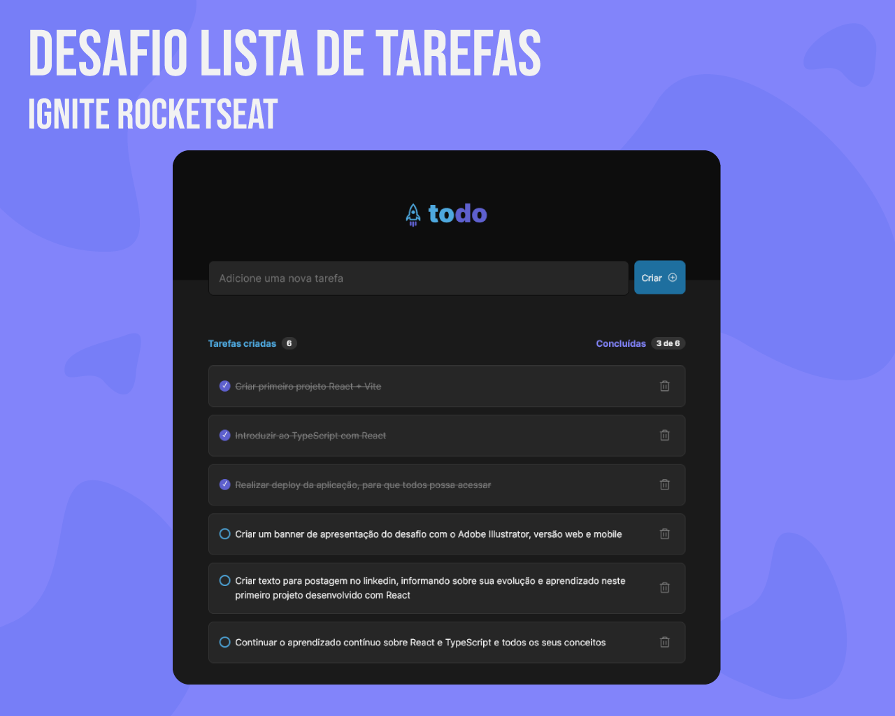
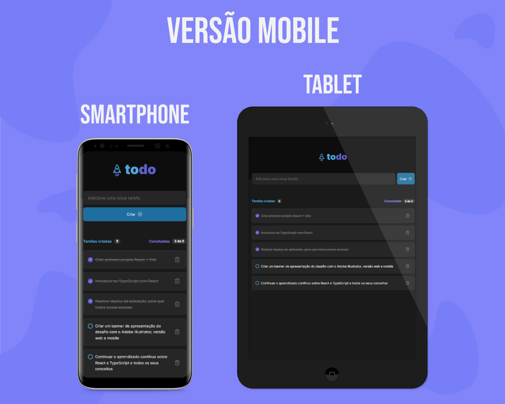

# Desafio Ignite Rocketseat - ToDo List

Este é um desafio onde precisamos praticar os conceitos do ReactJS. Os desafios da Rocketseat, nos ajudam a melhorar nossas habilidades práticas de desenvolvimento, para construir projetos realistas.

## Índice

- [Desafio Ignite Rocketseat - ToDo List](#desafio-ignite-rocketseat---todo-list)
  - [Índice](#índice)
  - [Visão Geral](#visão-geral)
    - [**O desafio**](#o-desafio)
    - [**Captura de tela - Versões Web e Mobile**](#captura-de-tela---versões-web-e-mobile)
    - [**Links**](#links)
  - [Meu processo](#meu-processo)
    - [**Construído com**](#construído-com)
    - [**O que eu aprendi**](#o-que-eu-aprendi)
      - [**Conhecimentos práticos aplicados durante o desenvolvimento**](#conhecimentos-práticos-aplicados-durante-o-desenvolvimento)
    - [**Desenvolvimento continuado**](#desenvolvimento-continuado)
    - [**Recursos úteis**](#recursos-úteis)
  - [Dev - Marco Santana](#dev---marco-santana)

## Visão Geral

### **O desafio**

Os usuários devem ser capazes de:

- Visualize o layout ideal para o site, dependendo do tamanho da tela do dispositivo.
- Ver os estados de foco para todos os elementos interativos na página
- Criar tarefas, selecionar tarefas concluídas e removê-las.
- Visualizar a quantidade de tarefas criadas, e quantas foram concluídas.

### **Captura de tela - Versões Web e Mobile**

  

### **Links**

- Site URL (Live): <a href="https://desafio-todo-list-rocketseat.vercel.app/" target="_blank">ToDo List</a>
- URL do Desafio: <a href="https://efficient-sloth-d85.notion.site/Desafio-01-Praticando-os-conceitos-do-ReactJS-91fd63dd1a5b4a2796152de293ec1074#94e82119898b4348ab8d5495dcb48565" target="_blank">Desafio 01 - Praticando os conceitos do ReactJS</a>

## Meu processo

### **Construído com**

- HTML5
- CSS3
- ReactJS + Vite
- JavaScript
- TypeScript

### **O que eu aprendi**

Neste desafio pude colocar em prática conhecimentos em ReactJS, adquiridos durante o primeiro módulo do curso no Ignite.

Consegui expandir minhas habilidades, encontrando soluções rápidas para o desenvolvimento deste projeto.

#### **Conhecimentos práticos aplicados durante o desenvolvimento**
- Componentes
- Module CSS
- Estados
- Imutabilidade do estado
- Listas e chaves no ReactJS
- Propriedades
- Componentização

### **Desenvolvimento continuado**

Irei focar no segundo módulo do Ignite a fim de desenvolver minhas habilidades técnicas, e construir melhores soluções para os próximos desafios.

Também irei continuar me desenvolvendo em TypeScript, para construir projetos consistentes, e conseguir trabalhar bem utilizando ReactJS.

### **Recursos úteis**

- [Um Guia completo para Flexbox](https://css-tricks.com/snippets/css/a-guide-to-flexbox/) - Gosto muito de utilizar o site do CSS-Tricks, para aprender sobre CSS, e utilizo muito esta página com dicas práticas de flexbox no CSS.

## Dev - Marco Santana
 

